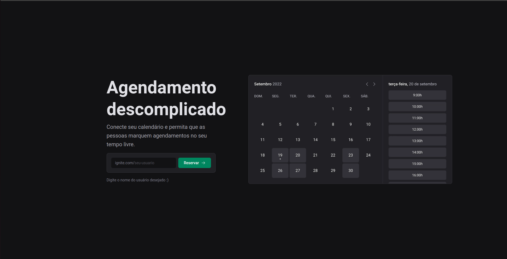

<h1 align="center"></h1>

<h3 align="center">Call App</h3>

<p align="center">“Software developers are students forever 🧠”</p>

<p align="center">
  <a href="#about">Sobre</a>&nbsp;&nbsp;&nbsp;|&nbsp;&nbsp;&nbsp;
  <a href="#install">Instalação</a>&nbsp;&nbsp;&nbsp;|&nbsp;&nbsp;&nbsp;
  <a href="#challenge">Desafios</a>&nbsp;&nbsp;&nbsp;|&nbsp;&nbsp;&nbsp;
  <a href="#technologies">Tecnologias</a>
</p>

## :speech_balloon: Sobre <a name="about"></a>

> O [Call App](call-app-douglasscaini.vercel.app) permite um agendamento descomplicado. Conecte seu calendário e permita que as pessoas marquem agendamentos no seu tempo livre.

<br />
<table>
  <tr>
    <td colspan="1">Web App</td>
  </tr>
  <tr>
    <td></td></td>
  </tr>
</table>

## :warning: Instalação <a name="install"></a>

```bash
# Instalar as dependências necessárias:
$ npm install

# Configurar variáveis de ambiente
$ .env.example -> .env

# Iniciar o projeto:
$ npm run dev

# Iniciar banco com prisma:
$ npm prisma studio
```

## :triangular_flag_on_post: Desafio <a name="challenge"></a>

> Aplicar conceitos de React utilizando Google Calendar e Prisma.

## :heavy_check_mark: Tecnologias <a name="technologies"></a>

-   [Zod](https://zod.dev/)
-   [Prisma](https://www.prisma.io/)
-   [TypeScript](https://www.typescriptlang.org/)
-   [Google Calendar](https://developers.google.com/calendar/api/guides/overview?hl=pt-br)

---

by [Douglas Scaini](https://www.github.com/douglasscaini) ❤️
